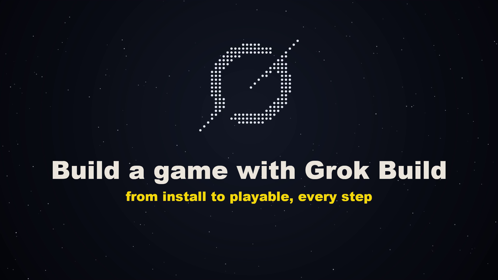

# build-a-game

A Grok Build skill. Run `/build-a-game`, give it a game idea, and Grok Build designs and builds a 2D Godot 4 game one playable step at a time, the same way LUNAR AGE was built in the video below.

[](https://github.com/7etsuo/grok-build-a-game/releases/download/v1/grok-build-lunar-age.mp4)

Video: [grok-build-lunar-age.mp4](https://github.com/7etsuo/grok-build-a-game/releases/download/v1/grok-build-lunar-age.mp4) (13:29, 1080p)

## Install

1. Install Grok Build (docs.x.ai, under Build):

   ```
   curl -fsSL https://x.ai/cli/install.sh | bash
   ```

2. Copy the skill into your Grok skills folder:

   ```
   git clone https://github.com/7etsuo/grok-build-a-game
   mkdir -p ~/.grok/skills
   cp -r grok-build-a-game/build-a-game ~/.grok/skills/
   ```

3. Make a new folder, run `git init` in it, start `grok`, and type `/build-a-game`.

## What it does

- Asks for your game idea first.
- Installs Godot 4 into `~/.local/bin` when `godot` isn't found. That step downloads the Linux build, so on macOS or Windows install Godot 4 yourself first and check that `godot --version` works.
- Writes house rules into `AGENTS.md` from `templates/AGENTS.md`.
- Runs `/design` to write `docs/GDD.md` with a build plan of small playable steps.
- Builds one step per turn, then stops so you can play it and commit.
- Makes the art with the game-assets skill and checks every sprite with `scripts/check_sprites.py`, which fails on painted checkerboards, green fringes and wrong sizes.
- Finishes with a look pass, a game feel pass and a 60 second attract mode.

The sprite check needs Python 3 (standard library only).
